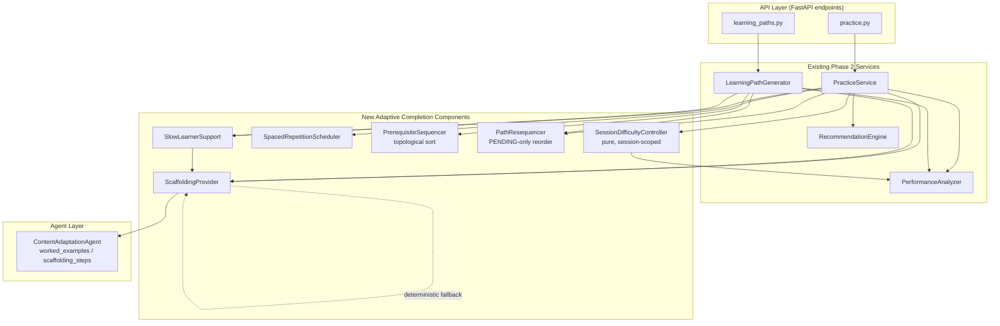

# Design Document

## Overview

This design completes the Phase 2 Adaptive Learning Engine by closing four integration gaps on top of the existing, passing workflow (`backend/tests/test_phase2_audit.py`). All work is **additive** and **integration-focused**: no existing public response field, mastery-band rule, calibration path, or learning-path status semantic changes value or type. New behavior is layered through four new, small, mostly-pure components that plug into the existing services (`PracticeService`, `LearningPathGenerator`, `PerformanceAnalyzer`) rather than replacing them.

The four gaps and their owning components:

| Gap | Requirement | New component | Wires into |
| --- | --- | --- | --- |
| In-session real-time difficulty adjustment + spaced repetition | R1 | `SessionDifficultyController`, `SpacedRepetitionScheduler` | `PracticeService`, `PerformanceAnalyzer` |
| Prerequisite-aware + performance-driven re-sequencing | R2 | `PrerequisiteSequencer`, `PathResequencer` | `LearningPathGenerator`, `PracticeService` |
| Adaptive scaffolding surfaced through core flow | R3 | `ScaffoldingProvider` | `PracticeService`, `LearningPathGenerator`, `ContentAdaptationAgent` |
| Slow-learner support | R4 | `SlowLearnerSupport` | `PracticeService`, `LearningPathGenerator`, `ScaffoldingProvider` |

Design principles carried from the existing codebase:
- **Deterministic, explainable rule logic** first; the LLM agent layer (`ContentAdaptationAgent`) is only a source of scaffolding *content*, always behind a deterministic fallback.
- **Async SQLAlchemy 2.0 + FastAPI + Pydantic v2** throughout; new schema fields are optional with defaults so existing serialization is unaffected.
- **Mastery bands are the single source of difficulty truth**: `<40` BEGINNER, `40–69` DEVELOPING, `70–84` PROFICIENT, `85+` ADVANCED, via `PerformanceAnalyzer.determine_topic_difficulty`.

The dominant language is Python, so correctness properties below are framed for property-based testing with Hypothesis (invariants for difficulty stepping, topological ordering, re-sequence preservation, and batch sizing) alongside example/integration tests for wiring and timing.

## Architecture

The new components sit as a thin adaptive layer between the API endpoints and the existing Phase 2 services. `SessionDifficultyController` is pure and session-scoped (no DB writes of its own); the sequencers and `SlowLearnerSupport` are pure helpers invoked by the existing services; `ScaffoldingProvider` bridges the async `ContentAdaptationAgent` into synchronous-feeling response assembly with a deterministic fallback.



Interaction summary:
- **Generate practice** (R1.1, R3.1, R4.1/4.3/4.4): `PracticeService.generate_practice_session` asks `PerformanceAnalyzer` for mastery → seeds `SessionDifficultyController` initial level → `SlowLearnerSupport` resolves batch size → `ScaffoldingProvider` attaches worked examples/steps.
- **Submit practice** (R1.2–R1.7, R2.3–R2.8): grading loop drives `SessionDifficultyController` step-up/down; the recorded adjustment log + final difficulty are added to the result; a mastery change triggers `PathResequencer` on the active path within the submit flow.
- **Generate / present path** (R2.1/2.2, R3.2/3.3, R4.2/4.5): `LearningPathGenerator` orders topics via `PrerequisiteSequencer`; item responses gain scaffolding via `ScaffoldingProvider`; `SlowLearnerSupport` caps per-topic items and breaks priority ties by duration.
- **Spaced repetition** (R1.8): `SpacedRepetitionScheduler` reads `TopicPerformance.last_attempted_at` and surfaces due topics oldest-first.

## Components and Interfaces

### 1. SessionDifficultyController (R1) — pure, session-scoped

Lives in `app/services/adaptive/session_difficulty.py`. Holds no DB state; it is instantiated per practice session with an initial level and configured thresholds, mutated as answers are graded, and its adjustment log is copied into the result. The ordered difficulty set reuses the existing `ContentDifficulty` enum.

```python
from dataclasses import dataclass, field
from typing import List
from app.models.curriculum import ContentDifficulty

DIFFICULTY_ORDER: list[ContentDifficulty] = [
    ContentDifficulty.BEGINNER,
    ContentDifficulty.DEVELOPING,
    ContentDifficulty.PROFICIENT,
    ContentDifficulty.ADVANCED,
]

@dataclass
class DifficultyAdjustment:
    from_level: ContentDifficulty
    to_level: ContentDifficulty
    direction: str            # "up" | "down"
    at_question_index: int    # 0-based position that triggered the change

@dataclass
class SessionDifficultyController:
    current: ContentDifficulty
    step_up_threshold: int    # default settings.SESSION_STEP_UP_THRESHOLD (3), clamped 1..10
    step_down_threshold: int  # default settings.SESSION_STEP_DOWN_THRESHOLD (3), clamped 1..10
    _consecutive_correct: int = 0
    _consecutive_incorrect: int = 0
    adjustments: List[DifficultyAdjustment] = field(default_factory=list)

    def record_answer(self, is_correct: bool, question_index: int) -> ContentDifficulty:
        """Update counters, apply bounded step, reset the relevant counter. Returns level for the NEXT question."""

    @property
    def final_difficulty(self) -> ContentDifficulty: ...

    @classmethod
    def for_initial_mastery(cls, mastery_pct: float, step_up: int, step_down: int) -> "SessionDifficultyController":
        # Seeds current via PerformanceAnalyzer.determine_topic_difficulty(mastery_pct)  (R1.1)
```

Stepping rules (R1.2–R1.5, R1.7):
- On correct: increment consecutive-correct, zero consecutive-incorrect. When it reaches `step_up_threshold`, move one level up in `DIFFICULTY_ORDER` (clamped at `ADVANCED`), append a `DifficultyAdjustment`, and reset consecutive-correct to 0 (reset happens even when already at `ADVANCED`).
- On incorrect: symmetric, clamped at `BEGINNER`.
- `current` is always a member of `DIFFICULTY_ORDER` (never an index outside `0..3`).

`PracticeService` integration: `generate_practice_session` builds the controller from mastery and serves the first question at `controller.current`; the client submits answers in order; `submit_practice_session` replays answers through the controller (or the client streams them), then writes `final_session_difficulty` and `session_difficulty_adjustments` into the result and persists the adjustment log on `PracticeAttempt.session_adjustments` (new nullable JSON column).

### 2. SpacedRepetitionScheduler (R1.8)

Lives in `app/services/adaptive/spaced_repetition.py`. Pure ranking over `TopicPerformance` rows.

```python
from datetime import datetime, timedelta, timezone

class SpacedRepetitionScheduler:
    @staticmethod
    def surface_due_topics(
        performances: list[TopicPerformance],
        now: datetime,
        interval_days: int,   # default settings.SPACED_REPETITION_INTERVAL_DAYS (3), clamped 1..90
    ) -> list[TopicPerformance]:
        """Return performances whose last_attempted_at is older than (now - interval),
        ordered oldest-last-attempt first. Topics with no last_attempted_at are excluded."""
```

Surfaced through a new additive field `spaced_repetition_due` on the performance overview and consumed by the recommendation surface; it never alters existing overview fields.

### 3. PrerequisiteSequencer (R2.1, R2.2)

Lives in `app/services/adaptive/prerequisite_sequencer.py`. Replaces the current `topics.sort(key=order_number)` seed in `LearningPathGenerator` with a Kahn topological sort over the `Topic.prerequisite_topic_id` edges already present in the model.

```python
class CycleDetected(Exception): ...

class PrerequisiteSequencer:
    @staticmethod
    def order_topics(topics: list[Topic]) -> tuple[list[Topic], bool]:
        """Return (ordered_topics, cyclic_detected).
        - Acyclic: Kahn's algorithm; every prerequisite precedes its dependents (R2.1).
          Ties among ready nodes broken by ascending order_number for determinism.
        - Cyclic: fall back to ascending order_number for the whole set, return cyclic_detected=True (R2.2)."""
```

`LearningPathGenerator.generate_path` calls this before allocating content; when `cyclic_detected` is true it records the indication on the path (new nullable `LearningPath.cyclic_dependency_detected` column and an additive response field) and continues without aborting.

### 4. PathResequencer (R2.3–R2.8)

Lives in `app/services/adaptive/path_resequencer.py`. Invoked from `PracticeService.submit_practice_session` after mastery recalculation, and reused by the generator.

```python
@dataclass
class ResequenceOutcome:
    applied: bool
    count_constraint_violated: bool
    reason: str

class PathResequencer:
    @staticmethod
    def needs_resequence(path: LearningPath, mastery_by_topic: dict[str, float]) -> bool:
        """True when the current PENDING ordering no longer reflects mastery gaps (R2.4)."""

    @staticmethod
    def resequence(path: LearningPath, mastery_by_topic: dict[str, float]) -> ResequenceOutcome:
        """Reorder ONLY PENDING items by mastery gap + prerequisite order (R2.5).
        COMPLETED / IN_PROGRESS / SKIPPED items keep exact sequence_number and status (R2.6).
        If resulting total count would fall outside 5..10, reject and retain prior ordering,
        set count_constraint_violated=True (R2.7, R2.8)."""
```

Timing (R2.3): the re-sequence runs synchronously inside the existing `submit_practice_session` DB transaction, so it completes well within the 3-second budget for the small (5–10 item) paths in scope; a representative timing assertion covers this in tests.

### 5. ScaffoldingProvider (R3, R4.3/4.4)

Lives in `app/services/adaptive/scaffolding_provider.py`. Bridges `ContentAdaptationAgent` (`worked_examples`, `scaffolding_steps`) into practice and path responses, always behind a deterministic, per-topic-stable fallback.

```python
@dataclass
class ScaffoldingBundle:
    worked_examples: list[dict]      # 1..5 (R3.1)
    scaffolding_steps: list[dict]    # 1..10 ordered {order:int, text:str, kind:"prereq"|"topic"}
    is_fallback: bool                # R3.4 indicator

class ScaffoldingProvider:
    async def build(
        self, db, topic, learner_context, *,
        prerequisite_gap: bool,        # R3.3
        simplified_language: bool = False,  # R4.4 -> requested via LearnerContextFrame
        full_steps: bool = False,      # R4.3 -> no truncation
    ) -> ScaffoldingBundle: ...

    def _deterministic_fallback(self, topic) -> ScaffoldingBundle:
        """Fixed, order-stable steps keyed only by topic; identical across repeated calls (R3.4)."""
```

Behavior:
- **Bounds (R3.1)**: clamp worked examples to 1..5 and steps to 1..10; if the agent returns more, truncate deterministically; if fewer than 1, fall back.
- **Prerequisite review step (R3.3)**: when `prerequisite_gap`, insert exactly one `kind="prereq"` step at order 1, before the topic's own steps.
- **Fallback (R3.4)**: on any agent exception or empty content, return the deterministic per-topic bundle with `is_fallback=True`, never raising.
- **Additivity (R3.5, R5.2)**: the provider only populates new response fields; it never mutates existing fields.
- **Simplified language (R4.4)**: sets the `simplified_language` flag in the `LearnerContextFrame` passed to the agent.

### 6. SlowLearnerSupport (R4)

Lives in `app/services/adaptive/slow_learner_support.py`. Pure resolution of pace + preferences into concrete parameters, with a documented default fallback.

```python
@dataclass
class PacingDecision:
    batch_size: int
    per_topic_item_cap: int
    full_scaffolding: bool
    simplified_language: bool
    prefer_short_sessions: bool
    fell_back_to_defaults: bool   # R4.6

class SlowLearnerSupport:
    @staticmethod
    def resolve(
        learning_pace: LearningPace | None,
        preference: LearningPreference | None,
        default_batch_size: int,
    ) -> PacingDecision:
        """R4.1: SLOW -> batch = max(3, default // 2).
        R4.2: SLOW -> per_topic_item_cap = 1 (else unbounded/default).
        R4.3: step_by_step -> full_scaffolding = True.
        R4.4: simplified_language flag passed through.
        R4.5: short_sessions -> prefer_short_sessions = True (tie-break by min estimated_duration_minutes).
        R4.6: pace/preference unresolved -> defaults + fell_back_to_defaults=True.
        R4.7: MODERATE/FAST with no flags -> defaults."""
```

Wiring: `PracticeService.generate_practice_session` uses `PacingDecision.batch_size` as `num_questions` (overriding the default when SLOW); `LearningPathGenerator` applies `per_topic_item_cap` and the `short_sessions` tie-break (the generator already sorts by `estimated_duration_minutes` when `prefers_short`, so this formalizes and bounds that behavior).

## Data Models

Schema Additions

All additions are optional/nullable to preserve existing behavior and serialization. No column is renamed or removed.

New config settings in `app/core/config.py` (`Settings`):

```python
SESSION_STEP_UP_THRESHOLD: int = 3            # clamped 1..10 (R1.2)
SESSION_STEP_DOWN_THRESHOLD: int = 3          # clamped 1..10 (R1.3)
SPACED_REPETITION_INTERVAL_DAYS: int = 3      # clamped 1..90 (R1.8)
DEFAULT_PRACTICE_BATCH_SIZE: int = 5          # existing default made explicit (R4.1)
SLOW_LEARNER_PER_TOPIC_ITEM_CAP: int = 1      # (R4.2)
```

SQLAlchemy model additions (async, SQLite/Postgres compatible, nullable):
- `PracticeAttempt.session_adjustments: Mapped[Optional[JSON]]` — persisted adjustment log (R1.6).
- `PracticeAttempt.final_session_difficulty: Mapped[Optional[ContentDifficulty]]` — nullable enum (R1.6).
- `LearningPath.cyclic_dependency_detected: Mapped[Optional[bool]]` — default `None`/`False` (R2.2).

Pydantic v2 schema additions (all `Optional` with defaults so absence keeps old shape):

`PracticeSessionResponse` (generate):
```python
worked_examples: List[Dict[str, Any]] = []        # R3.1
scaffolding_steps: List[Dict[str, Any]] = []       # R3.1
scaffolding_is_fallback: bool = False              # R3.4
initial_session_difficulty: Optional[ContentDifficulty] = None  # R1.1
```

`PracticeResultResponse` (submit) — existing fields unchanged (R5.2), add:
```python
final_session_difficulty: Optional[ContentDifficulty] = None       # R1.6
session_difficulty_adjustments: List[Dict[str, Any]] = []          # R1.6
resequence_applied: bool = False                                   # R2.4
resequence_count_constraint_violated: bool = False                 # R2.8
pacing_fell_back_to_defaults: bool = False                         # R4.6
```

`LearningPathItemResponse` — existing fields unchanged, add:
```python
scaffolding_steps: List[Dict[str, Any]] = []       # R3.2
scaffolding_is_fallback: bool = False              # R3.4
```

`LearningPathResponse` — add:
```python
cyclic_dependency_detected: bool = False           # R2.2
```

`LearnerPerformanceOverviewResponse` — add:
```python
spaced_repetition_due: List[TopicPerformanceMetric] = []  # R1.8
```

## Error Handling

- **Scaffolding unavailable (R3.4)**: `ScaffoldingProvider` catches all `ContentAdaptationAgent` exceptions and empty results and returns the deterministic per-topic fallback with `is_fallback=True`; it never propagates an error to the endpoint. This mirrors the existing agent fallback pattern.
- **Cyclic prerequisites (R2.2)**: `PrerequisiteSequencer` returns `(order_number_sorted, True)` instead of raising to the caller; generation completes.
- **Re-sequence count violation (R2.8)**: `PathResequencer.resequence` returns `ResequenceOutcome(applied=False, count_constraint_violated=True, ...)` and leaves the path untouched; the submit flow proceeds normally.
- **Unresolvable pace/preferences (R4.6)**: `SlowLearnerSupport.resolve` treats `None` inputs as defaults and sets `fell_back_to_defaults=True`; no exception.
- **Difficulty bounds (R1.4/R1.5/R1.7)**: `SessionDifficultyController` clamps at the ends of `DIFFICULTY_ORDER`; an out-of-range index is structurally impossible.
- **Regression safety (R5)**: because every new field is optional with a default and the deterministic fallbacks never raise, the existing audit assertions (`recommended_next_action`, `reviews`, `progress_percentage`, path `status`, `5 <= total_items <= 10`, `first_item.status == in_progress`) remain satisfied unchanged.

## Correctness Properties

*A property is a characteristic or behavior that should hold true across all valid executions of a system — essentially, a formal statement about what the system should do. Properties serve as the bridge between human-readable specifications and machine-verifiable correctness guarantees.*

### Property 1: Initial session difficulty matches mastery calibration

For any mastery percentage in [0, 100], the `SessionDifficultyController`'s initial difficulty equals `PerformanceAnalyzer.determine_topic_difficulty(mastery_percentage)`.

**Validates: Requirements 1.1**

### Property 2: Bounded single-step difficulty adjustment

For any starting difficulty in {BEGINNER, DEVELOPING, PROFICIENT, ADVANCED} and any configured thresholds in [1, 10], feeding exactly `step_up_threshold` consecutive correct answers raises the difficulty by exactly one level (or leaves it at ADVANCED) and resets the consecutive-correct counter; feeding exactly `step_down_threshold` consecutive incorrect answers lowers it by exactly one level (or leaves it at BEGINNER) and resets the consecutive-incorrect counter; and after any sequence of answers the current difficulty is always a member of the four-level ordered set.

**Validates: Requirements 1.2, 1.3, 1.4, 1.5, 1.7, 5.4**

### Property 3: Adjustment log replays to the recorded final difficulty

For any sequence of graded answers, applying the recorded ordered list of difficulty adjustments to the initial difficulty reproduces the recorded final session difficulty, and both fields are present in the practice result.

**Validates: Requirements 1.6**

### Property 4: Spaced-repetition surfacing is complete and oldest-first

For any set of topic performances and any interval in [1, 90] days, the surfaced list contains exactly those topics whose last attempt is older than the interval, excludes every topic that is not, and is ordered by ascending last-attempt time (oldest first).

**Validates: Requirements 1.8**

### Property 5: Prerequisite topological ordering

For any acyclic set of topics linked by prerequisite relationships, in the generated ordering every prerequisite topic appears at a strictly lower position index than each topic that declares it as a prerequisite.

**Validates: Requirements 2.1, 5.5**

### Property 6: Cyclic dependency fallback

For any set of topics containing at least one prerequisite cycle, ordering completes without raising, the affected items are ordered by ascending `order_number`, and the cyclic-dependency indication is recorded.

**Validates: Requirements 2.2**

### Property 7: Re-sequence preserves non-PENDING items and reorders only PENDING items

For any learning path with a mix of item statuses, after a mastery-triggered re-sequence the set of PENDING items is unchanged and only their relative positions may differ, while every COMPLETED, IN_PROGRESS, and SKIPPED item retains its exact `sequence_number` and status.

**Validates: Requirements 2.5, 2.6**

### Property 8: Re-sequence keeps item count within bounds

For any valid learning path whose item count is in [5, 10], the item count after a successfully applied re-sequence remains in [5, 10]; if a computed re-sequence would fall outside that range it is rejected, the prior ordering is retained, and the count-constraint violation is recorded.

**Validates: Requirements 2.7, 2.8**

### Property 9: Scaffolding content respects count bounds and ordering

For any practice session response, the attached worked examples number between 1 and 5 inclusive and the scaffolding steps number between 1 and 10 inclusive and carry a strictly increasing order.

**Validates: Requirements 3.1, 5.7**

### Property 10: Path-item scaffolding uses the same ordered structure

For any presented learning-path item, its response includes ordered scaffolding steps with the same structure (ordered `{order, text, kind}` steps) as the practice session response.

**Validates: Requirements 3.2**

### Property 11: Prerequisite-review step placement

For any current topic with an uncompleted prerequisite, the scaffolding step sequence contains exactly one prerequisite-review step positioned before all of the current topic's own steps; when no such gap exists, no prerequisite-review step is inserted.

**Validates: Requirements 3.3**

### Property 12: Deterministic, order-stable fallback scaffolding

For any topic, when scaffolding content is unavailable the provider returns between 1 and 10 ordered steps marked as fallback, identical across repeated requests for the same topic, without raising an error.

**Validates: Requirements 3.4**

### Property 13: Scaffolding is purely additive

For any practice or pathway response, every field present before scaffolding was added retains the same name, type, and value it would have without scaffolding, and scaffolding content appears only in additional fields.

**Validates: Requirements 3.5, 5.2**

### Property 14: Slow-learner batch sizing

For any default batch size, when the learner's pace is SLOW the resolved practice batch size equals `max(3, default // 2)`.

**Validates: Requirements 4.1**

### Property 15: Slow-learner per-topic item cap

For any set of topics, a path generated for a SLOW-pace learner introduces at most one new learning-path item per topic.

**Validates: Requirements 4.2**

### Property 16: Full scaffolding when step-by-step is enabled

For any presented item, when the `step_by_step` preference is true the returned scaffolding steps equal the full available set (no truncation) and number at least as many as when it is false.

**Validates: Requirements 4.3**

### Property 17: Short-session minimum-duration selection

For any set of candidate items of equal priority, when the `short_sessions` preference is true the selected item has the minimum `estimated_duration_minutes` among the candidates.

**Validates: Requirements 4.5**

### Property 18: Slow pace yields a strictly smaller batch than default

For any default batch size of at least 4, the batch size resolved for a SLOW-pace learner is strictly smaller than the batch size resolved for an otherwise-identical non-SLOW learner.

**Validates: Requirements 4.7, 5.6**

## Testing Strategy

### Regression protection (R5.1–R5.3)
- The existing `backend/tests/test_phase2_audit.py` runs unchanged and must pass 100% (zero failures/errors) within 120 seconds. Because all new fields are optional with defaults and no existing field changes name/type/value, the 17-step workflow assertions (`recommended_next_action`, `reviews`, `progress_percentage`, path `status`, `5 <= total_items <= 10`, `first_item.status == "in_progress"`) continue to hold. Run via `pytest backend/tests/test_phase2_audit.py` using the same in-memory SQLite + demo-seed fixture.
- A schema-stability example test asserts `PracticeResultResponse` and `LearningPathResponse` still expose the named fields with their original types (R5.2).

### Property-based tests (Hypothesis)
Each property test runs a minimum of 100 iterations and is tagged **Feature: adaptive-learning-engine, Property {number}: {property_text}**.
- **Difficulty controller** (Properties 1, 2, 3): generators over mastery percentages, starting difficulties, thresholds in [1,10], and random correct/incorrect answer streams. Assert calibration, bounded single-stepping, boundary clamping at BEGINNER/ADVANCED, membership invariant, and adjustment-log replay. These are pure and fast (no DB).
- **Spaced repetition** (Property 4): generate topic-performance timestamps and intervals; assert completeness and oldest-first ordering.
- **Sequencing** (Properties 5, 6): generate random acyclic prerequisite graphs (topological invariant) and graphs seeded with a cycle (fallback + flag).
- **Re-sequencing** (Properties 7, 8): generate paths with mixed statuses and 5–10 items; assert PENDING-only reorder, non-PENDING preservation, and count-bound enforcement/rejection.
- **Scaffolding** (Properties 9–13): generate topics/responses; assert count bounds, ordered structure parity between practice and path items, single prerequisite-review step placement, deterministic fallback stability, and additivity (compare responses with scaffolding on/off — original fields identical).
- **Slow-learner support** (Properties 14–18): generate default batch sizes and preference/pace combinations; assert batch formula, per-topic cap, full-steps behavior, min-duration tie-break, and the strictly-smaller-than-default comparison.

### Example / edge-case tests
- R1.4/R1.5 boundary starts (ADVANCED raise, BEGINNER lower) — folded into the stepping generator but also asserted explicitly.
- R2.4 stale-vs-fresh ordering triggers/skips re-sequence.
- R2.8 forced count-violation retains prior ordering.
- R4.4 simplified-language request is passed to the provider (mock/spy on `ScaffoldingProvider.build`).
- R4.6 unresolved pace/preferences applies defaults and sets the fallback flag.
- R4.7 MODERATE/FAST with no flags equals defaults.

### Integration / timing tests
- R2.3: submit a mastery-changing practice attempt against the seeded demo learner and assert the active path re-sequence runs within the submit flow under the 3-second budget (single representative measurement).
- New audit-suite additions (R5.4–R5.7) are added as targeted tests alongside the existing audit test: difficulty ±1 bounded stepping, prerequisite-before-dependents ordering, SLOW batch strictly smaller than non-SLOW, and practice response containing ≥1 scaffolding step.

### Why not PBT for certain criteria
Timing (R2.3), the audit-suite run semantics (R5.1, R5.3), and the simplified-language wiring assertion (R4.4) are wiring/environment concerns with no meaningful per-input variation, so they use integration/example tests rather than property tests, per the PBT decision guide.
