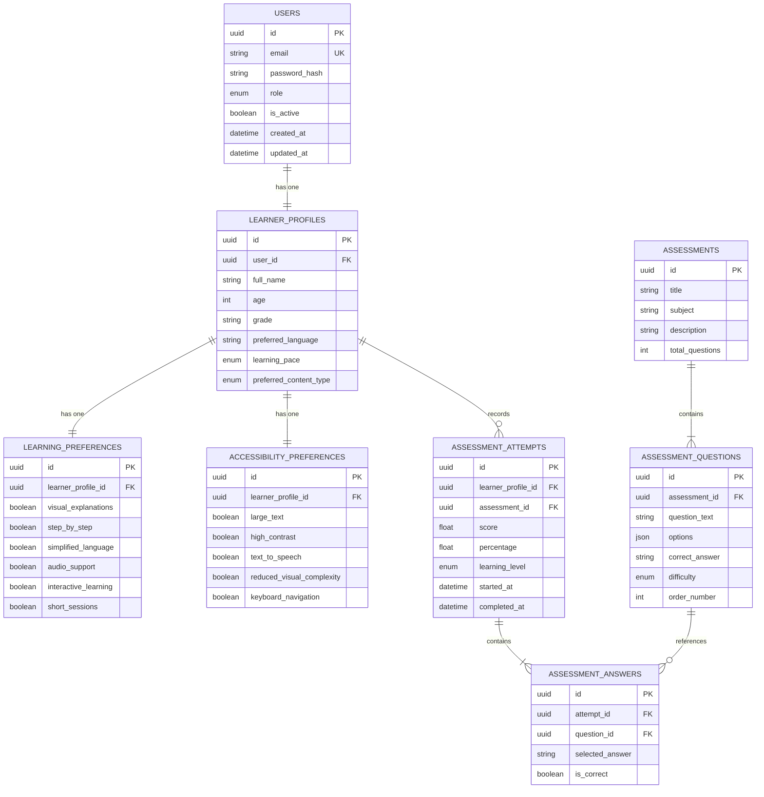

# Smart Inclusive Learning Ecosystem (SILE)

An AI-powered inclusive learning ecosystem designed to deliver personalized, adaptive, and supportive learning experiences for diverse learners, slow learners, and students with varied cognitive and accessibility needs.

---

## Table of Contents
1. [Project Overview](#project-overview)
2. [Problem Being Addressed](#problem-being-addressed)
3. [Phase 1 Objective](#phase-1-objective)
4. [Technology Stack](#technology-stack)
5. [System Architecture](#system-architecture)
6. [Project Structure](#project-structure)
7. [Phase 1 Features Implemented](#phase-1-features-implemented)
8. [Database Entities & Schema](#database-entities--schema)
9. [API Overview](#api-overview)
10. [Core Application Flows](#core-application-flows)
    - [Authentication Flow](#authentication-flow)
    - [Learner Profile Flow](#learner-profile-flow)
    - [Baseline Assessment Flow](#baseline-assessment-flow)
    - [Dashboard Flow](#dashboard-flow)
11. [Setup & Installation Instructions](#setup--installation-instructions)
    - [Environment Variables](#environment-variables)
    - [Database & Seed Data Setup](#database--seed-data-setup)
    - [Starting the Backend](#starting-the-backend)
    - [Starting the Frontend](#starting-the-frontend)
12. [Live Demo Walkthrough](#live-demo-walkthrough)
13. [Roadmap & Future Phases](#roadmap--future-phases)

---

## Project Overview

**Smart Inclusive Learning Ecosystem (SILE)** is an intelligent educational platform built to overcome the limitations of traditional, rigid educational models. By placing accessibility, multi-modal content preferences, and adaptive pacing at the core of instructional delivery, SILE ensures that every learner—regardless of cognitive processing speed, accessibility accommodation requirements, or baseline proficiency—receives an individualized learning journey.

---

## Problem Being Addressed

1. **One-Size-Fits-All Instruction**: Traditional learning management systems treat all students uniformly, leaving slower learners behind and failing to adapt to individual paces.
2. **Neglected Accessibility Needs**: Most educational portals lack built-in accessibility features (such as font-size scaling, high-contrast modes, and screen-reader optimizations), creating friction for students with visual or cognitive challenges.
3. **Medicalizing vs. Accommodating**: Traditional platforms often rely on rigid, deficit-based classifications rather than dynamically adapting to observable learning preferences and support needs.
4. **Lack of Baseline Diagnostic Readiness**: Students are frequently assigned coursework without prior evaluation of their foundational mastery, leading to cognitive overload.

---

## Phase 1 Objective: Foundation and Learner Profiling

The primary goal of **Phase 1** is to establish the secure, modular, and accessible architectural foundation of SILE:

* Robust **User Authentication** and JWT session security.
* Comprehensive **Learner Profiling** capturing demographic basics, learning pace, and preferred content modality.
* Granular **Learning Preferences** (visual explanations, step-by-step guidance, simplified language, interactive learning).
* System-wide **Accessibility Accommodations** (font scaling, high-contrast mode, Web Speech TTS readiness, visible focus states).
* Foundational **10-Question Mathematics Baseline Assessment** with objective readiness scoring (`Beginner`, `Developing`, `Proficient`).
* Real-time **Learner Dashboard** aggregating live database metrics, profile completion, and diagnostic attempt history.

---

## Technology Stack

### Backend
* **Language & Runtime**: Python 3.11+
* **Web Framework**: FastAPI (Async REST architecture)
* **ORM & Data Layer**: SQLAlchemy 2.0 (Async engine) + Alembic
* **Validation & Settings**: Pydantic v2 & Pydantic-Settings
* **Database**: PostgreSQL (with SQLite async fallback for local zero-config testing)
* **Security & Auth**: PyJWT (HS256) + Passlib / Bcrypt password hashing
* **Testing**: Pytest + Pytest-Asyncio + HTTPX

### Frontend
* **Core Library**: React 18
* **Language**: TypeScript (Strict Mode)
* **Build Tool & Dev Server**: Vite
* **Styling**: Tailwind CSS + Vanilla CSS Tokens
* **Routing**: React Router v6
* **HTTP Client**: Axios (with custom token and error interceptors)
* **Accessibility**: Native Web Speech API, WCAG 2.1 AA/AAA compliant semantics & ARIA controls

---

## System Architecture

```text
┌────────────────────────────────────────────────────────────────────────┐
│                   React 18 + TypeScript Web Client                    │
│  ┌───────────────────────┬──────────────────────────────────────────┐  │
│  │   Responsive Views    │      Accessibility Quick-Controls        │  │
│  │   • Landing & Auth    │      • A- / 100% / A+ Font Scaler        │  │
│  │   • Profile Portal    │      • ◐ High Contrast Theme Toggle     │  │
│  │   • Math Diagnostic   │      • 🔊 Native Web Speech Read Aloud   │  │
│  │   • Learner Dashboard │      • Keyboard Navigation & Focus Ring  │  │
│  └───────────┬───────────┴──────────────────────────────────────────┘  │
└──────────────┼─────────────────────────────────────────────────────────┘
               │  JSON / Bearer JWT Authorization
               ▼
┌────────────────────────────────────────────────────────────────────────┐
│                        FastAPI REST Backend                            │
│  ┌──────────────────────────────────────────────────────────────────┐  │
│  │   API Routers (/api/v1)                                          │  │
│  │   • /auth (Register, Login, /me)                                 │  │
│  │   • /learner/profile (GET & PUT Profile + Preferences)           │  │
│  │   • /assessments (List, Detail, Attempt Submission)              │  │
│  │   • /dashboard (Live Aggregation & History Engine)               │  │
│  └──────────────────┬───────────────────────────────────────────────┘  │
│                     │ Async Service Layer                              │
│  ┌──────────────────┴───────────────────────────────────────────────┐  │
│  │   Business Logic & Scoring Engine                                │  │
│  │   • AuthService • ProfileService • AssessmentService • Dashboard │  │
│  └──────────────────┬───────────────────────────────────────────────┘  │
└─────────────────────┼──────────────────────────────────────────────────┘
                      │ SQLAlchemy 2.0 Async ORM
                      ▼
┌────────────────────────────────────────────────────────────────────────┐
│                     PostgreSQL / SQLite Database                       │
│   • users                  • learner_profiles                          │
│   • learning_preferences   • accessibility_preferences                 │
│   • assessments            • assessment_questions                      │
│   • assessment_attempts    • assessment_answers                        │
└────────────────────────────────────────────────────────────────────────┘
```

---

## Project Structure

```text
sile/
├── backend/
│   ├── app/
│   │   ├── api/
│   │   │   ├── dependencies.py          # JWT authentication & user resolution
│   │   │   └── v1/
│   │   │       ├── api_router.py        # Centralized v1 router aggregation
│   │   │       └── endpoints/           # auth, profiles, assessments, dashboard
│   │   ├── core/                        # config, security (bcrypt/jwt), exception handlers
│   │   ├── db/
│   │   │   ├── base.py                  # Declarative SQLAlchemy base
│   │   │   ├── session.py               # Async engine and session factories
│   │   │   └── seeds/
│   │   │       └── demo_seed.py         # Idempotent demo account & math diagnostic seed
│   │   ├── models/                      # User, Profile, Preference, Assessment models
│   │   ├── schemas/                     # Pydantic v2 request & response schemas
│   │   ├── services/                    # Clean business logic & scoring engine
│   │   └── main.py                      # FastAPI lifespan, CORS, and health endpoints
│   ├── tests/                           # 8 unit and integration test suites
│   ├── requirements.txt                 # Backend Python dependencies
│   └── .env.example                     # Environment template
│
├── frontend/
│   ├── src/
│   │   ├── components/
│   │   │   ├── common/                  # Navbar, Sidebar, AccessibilityToolbar
│   │   │   └── ui/                      # Button, Input, Select, Card, Modal, Spinner
│   │   ├── context/                     # AuthContext, AccessibilityContext
│   │   ├── hooks/                       # useAuth, useAccessibility
│   │   ├── layouts/                     # RootLayout, AuthLayout, DashboardLayout
│   │   ├── pages/
│   │   │   ├── auth/                    # LoginPage, RegisterPage
│   │   │   ├── assessment/              # AssessmentListPage, TakeAssessmentPage, ResultsPage
│   │   │   ├── dashboard/               # DashboardPage (Live metrics)
│   │   │   └── profile/                 # ProfilePage
│   │   ├── routes/                      # AppRoutes, ProtectedRoute
│   │   ├── services/                    # Axios API client, auth, profile, assessment services
│   │   ├── styles/                      # Tailwind styles & High Contrast definitions
│   │   └── types/                       # TypeScript models and response interfaces
│   ├── package.json                     # Frontend Node dependencies
│   ├── vite.config.ts                   # Vite bundler configuration
│   └── .env.example                     # Environment template
│
└── README.md
```

---

## Phase 1 Features Implemented

* [x] **Secure Authentication**: Email & password validation, bcrypt hashing, JWT access token generation, client-side session logout.
* [x] **Learner Profile Management**: Captures demographic details, learning pace (`slow`, `moderate`, `fast`), and content modality (`text`, `visual`, `audio`, `interactive`, `mixed`).
* [x] **Multi-Modal Learning Preferences**: Persists flags for visual explanations, step-by-step guidance, simplified language, and short learning sessions.
* [x] **Accessibility Accommodations**: Font size scaling ($90\%\text{--}140\%$), high contrast theming, visible focus rings, native Web Speech API read-aloud support, skip-to-content links.
* [x] **10-Question Baseline Mathematics Assessment**: Seeded diagnostic spanning arithmetic, fractions, percentages, elementary algebra, geometry, and number patterns.
* [x] **Objective Readiness Scoring**: Automatic grading into `Beginner` ($0\text{--}39\%$), `Developing` ($40\text{--}69\%$), and `Proficient` ($70\text{--}100\%$).
* [x] **Live Learner Dashboard**: Live profile completion percentage bar, preferences summary, assessment status, and chronological diagnostic attempt history.
* [x] **Robust Error Handling**: Sanitized server responses preventing internal stack trace leaks; user-friendly inline and banner messages.
* [x] **Automated Test Coverage**: 8/8 backend test suites passing + complete live end-to-end HTTP integration test passing.

---

## Database Entities & Schema



---

## API Overview

All API endpoints are prefixed with `/api/v1` and return standardized JSON payloads:

### 1. Health
* `GET /api/health` — Returns backend health status.

### 2. Authentication (`/api/v1/auth`)
* `POST /auth/register` — Register a new learner account and initialize learner profile.
* `POST /auth/login` — Authenticate credentials and receive JWT access token.
* `GET /auth/me` — Retrieve the current authenticated learner and profile.

### 3. Learner Profile & Preferences (`/api/v1/learner/profile`)
* `GET /learner/profile` — Fetch the learner's profile, learning preferences, and accessibility preferences.
* `PUT /learner/profile` — Update profile demographics, pace, modality, and accommodation flags.

### 4. Baseline Assessments (`/api/v1/assessments`)
* `GET /assessments` — List available diagnostic assessments.
* `GET /assessments/{id}` — Retrieve assessment questions and options (omits correct answers).
* `POST /assessments/{id}/attempt` — Grade submitted answers, compute percentage, assign learning level, and persist attempt history.

### 5. Learner Dashboard (`/api/v1/dashboard`)
* `GET /dashboard/overview` — Retrieve live aggregated metrics, profile completion percentage, preference summaries, and previous assessment attempts.

---

## Core Application Flows

### Authentication Flow
1. **Registration**: The user submits `email`, `password`, and `full_name` $\rightarrow$ Password is verified for strength and hashed with bcrypt $\rightarrow$ User and initial LearnerProfile are committed $\rightarrow$ Redirects to login.
2. **Login**: User submits credentials $\rightarrow$ Backend verifies hash and returns a signed JWT $\rightarrow$ Frontend stores token in `localStorage` and sets React `AuthContext` state $\rightarrow$ Redirects to `/dashboard`.
3. **Session Guards**: Unauthenticated requests to protected routes redirect immediately to `/login`.

### Learner Profile Flow
1. Learner navigates to `/profile` $\rightarrow$ Profile and preferences are retrieved via `GET /api/v1/learner/profile`.
2. Learner updates fields (e.g. pace to `slow`, content to `visual`, enabling `step_by_step` and `high_contrast`).
3. Learner clicks **Save Changes** $\rightarrow$ `PUT /api/v1/learner/profile` updates records in the database $\rightarrow$ Live success banner is displayed.

### Baseline Assessment Flow
1. Learner opens `/assessments` $\rightarrow$ Selects "Foundational Mathematics Baseline Diagnostic".
2. Learner answers 10 multiple-choice questions one at a time with option selection cards, progress bar, question jump pills, and optional Web Speech TTS audio readout.
3. On submission, the accidental submission guard verifies that all questions are answered.
4. Backend evaluates responses $\rightarrow$ Computes score & percentage $\rightarrow$ Classifies readiness level (`Beginner`, `Developing`, `Proficient`) $\rightarrow$ Persists results $\rightarrow$ Displays results page with full review and "Return to Dashboard" action.

### Dashboard Flow
1. Learner opens `/dashboard` $\rightarrow$ Frontend executes `GET /api/v1/dashboard/overview`.
2. Dashboard renders:
   * Personalized welcome banner.
   * Visual profile completion progress bar (e.g. `80%`).
   * Learning preferences and accessibility summaries.
   * Baseline diagnostic status card showing the latest score and readiness level.
   * Assessment attempt history table.

---

## Setup & Installation Instructions

### Prerequisites
* **Python**: 3.11 or higher
* **Node.js**: 18.x or higher & `npm`
* **PostgreSQL** (Optional; SQLite async fallback is configured by default for zero-friction local testing)

---

### Environment Variables

#### 1. Backend (`sile/backend/.env`)
Create `sile/backend/.env` by copying `.env.example`:
```env
PROJECT_NAME="Smart Inclusive Learning Ecosystem (SILE) API"
API_V1_STR="/api/v1"
DEBUG=True
ENVIRONMENT="development"
HOST="127.0.0.1"
PORT=8000
BACKEND_CORS_ORIGINS=["http://localhost:5173", "http://127.0.0.1:5173"]
SECRET_KEY="dev_secret_key_please_change_in_production_env"
ALGORITHM="HS256"
ACCESS_TOKEN_EXPIRE_MINUTES=60
DATABASE_URL="sqlite+aiosqlite:///./sile.db"
```

#### 2. Frontend (`sile/frontend/.env`)
Create `sile/frontend/.env` by copying `.env.example`:
```env
VITE_API_BASE_URL=http://localhost:8000/api/v1
VITE_APP_ENV=development
VITE_APP_NAME="Smart Inclusive Learning Ecosystem"
```

---

### Database & Seed Data Setup

The backend includes a safe, repeatable seed script that provisions the demo account and 10-question math baseline diagnostic:

```bash
cd backend
python -m app.db.seeds.demo_seed
```

---

### Starting the Backend

```bash
cd backend

# Create & activate virtual environment
python -m venv venv

# Windows (PowerShell):
.\venv\Scripts\activate
# Linux/macOS:
source venv/bin/activate

# Install dependencies
pip install -r requirements.txt

# Start FastAPI development server
uvicorn app.main:app --reload --host 127.0.0.1 --port 8000
```
* **API Server**: `http://127.0.0.1:8000`
* **Swagger UI Documentation**: `http://127.0.0.1:8000/api/v1/docs`

---

### Starting the Frontend

```bash
cd frontend

# Install dependencies
npm install

# Start Vite development server
npm run dev
```
* **Web Application**: `http://127.0.0.1:5173`

---

## Live Demo Walkthrough

### Pre-Configured Demo Credentials
* **Email**: `demo.learner@sile.org`
* **Password**: `DemoPassword123`

### Step-by-Step Demonstration Script
1. Navigate to `http://localhost:5173`.
2. Interact with the **Accessibility Toolbar** in the top navigation bar:
   - Click `A+` to enlarge text across the entire interface.
   - Click `◐ Contrast` to switch to high-contrast mode.
   - Click `🔊 TTS` to activate read-aloud support.
3. Sign in using the demo account credentials.
4. On the **Learner Dashboard**, observe the live profile completion gauge and current preference summaries.
5. Click **Take Assessment** to launch the 10-question Mathematics baseline diagnostic.
6. Answer the questions, click **Listen** to hear any question read aloud, and submit.
7. Review your calculated score, percentage accuracy, and assigned learning level (`Proficient`, `Developing`, or `Beginner`).
8. Click **Return to Dashboard** to verify that your assessment attempt has been recorded in the history table.

---

## Roadmap & Future Phases

```
┌────────────────────────────────────────────────────────────────────────┐
│  Phase 1: Foundation and Learner Profiling           [ COMPLETED ]     │
├────────────────────────────────────────────────────────────────────────┤
│  Phase 2: Adaptive Learning Engine                   [ UPCOMING ]      │
├────────────────────────────────────────────────────────────────────────┤
│  Phase 3: Multi-Agent Intelligence                   [ UPCOMING ]      │
├────────────────────────────────────────────────────────────────────────┤
│  Phase 4: Accessibility and Learning Analytics       [ UPCOMING ]      │
├────────────────────────────────────────────────────────────────────────┤
│  Phase 5: Integration, Evaluation and Deployment     [ UPCOMING ]      │
└────────────────────────────────────────────────────────────────────────┘
```

* **Phase 1: Foundation and Learner Profiling** `[COMPLETED]`:
  Core infrastructure, secure authentication, multi-modal learner profiling, accessibility accommodations, baseline mathematics diagnostic, and real-time dashboard analytics.

* **Phase 2: Adaptive Learning Engine** `[UPCOMING]`:
  Dynamic difficulty adjustment, personalized learning pathway generation, adaptive scaffolding, and slow-learner support modules.

* **Phase 3: Multi-Agent Intelligence** `[UPCOMING]`:
  Collaborative multi-agent pedagogical system (Tutor Agent, Explainer Agent, Assessment Agent, and Emotion/Pacing Support Agent).

* **Phase 4: Accessibility and Learning Analytics** `[UPCOMING]`:
  Advanced multimodal interactions, speech-to-text, dyslexia-friendly interfaces, automated cognitive load tracking, and educator analytics.

* **Phase 5: Integration, Evaluation and Deployment** `[UPCOMING]`:
  End-to-end system evaluation, user studies, performance benchmarking, containerized production deployment, and CI/CD pipelines.
